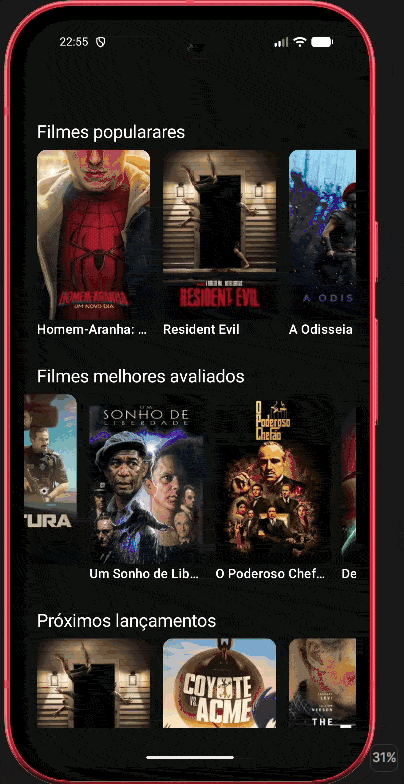
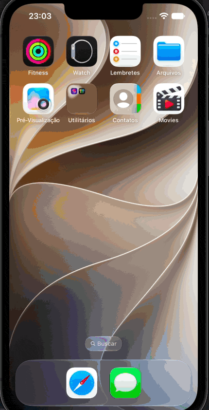

# Movies - App de Filmes (Compose Multiplatform)

Este é um projeto de estudo desenvolvido com **Kotlin Multiplatform (KMP)** e **Compose Multiplatform**, permitindo o compartilhamento de lógica de negócio e interface de usuário entre as plataformas **Android** e **iOS**.

O aplicativo utiliza a API do [The Movie Database (TMDB)](https://www.themoviedb.org/) para listar filmes, exibir detalhes, elenco e trailers.

## 🚀 Tecnologias Utilizadas

O projeto utiliza as tecnologias mais modernas do ecossistema Kotlin:

- **[Kotlin Multiplatform (KMP)](https://kotlinlang.org/docs/multiplatform.html)**: Compartilhamento de código entre Android e iOS.
- **[Compose Multiplatform](https://www.jetbrains.com/lp/compose-multiplatform/)**: Interface de usuário declarativa compartilhada.
- **[Ktor Client](https://ktor.io/docs/client-dependencies.html)**: Cliente HTTP para consumo da API REST.
- **[Koin](https://insert-koin.io/)**: Injeção de Dependência.
- **[Kotlinx Serialization](https://kotlinlang.org/docs/serialization.html)**: Serialização de dados JSON.
- **[Coil3](https://coil-kt.github.io/coil/)**: Carregamento de imagens otimizado para Multiplatform.
- **[BuildKonfig](https://github.com/yshrsmz/BuildKonfig)**: Gerenciamento de variáveis de configuração em tempo de compilação.
- **[Kotlinx Coroutines](https://kotlinlang.org/docs/coroutines-overview.html)**: Programação assíncrona.
- **[Kotlinx Datetime](https://github.com/Kotlin/kotlinx-datetime)**: Manipulação de datas e horas.

## 🏗️ Arquitetura

O projeto segue os princípios da **Clean Architecture** e o padrão de projeto **MVVM (Model-View-ViewModel)**, garantindo uma separação clara de responsabilidades e facilitando a testabilidade:

- **Data Layer**: Responsável pelo consumo da API via Ktor, mapeamento de dados (Mappers) e implementação dos repositórios.
- **Domain Layer**: Contém os modelos de dados e a lógica de negócio pura.
- **UI Layer**: Composta pelas telas desenvolvidas em Compose Multiplatform e pelos ViewModels, que gerenciam o estado da UI de forma reativa.
- **Dependency Injection**: O **Koin** é utilizado para orquestrar a injeção de dependências entre todas as camadas no módulo `shared`.

## 🔑 Configuração do Token da API

Para que o aplicativo funcione corretamente, você deve configurar o seu **Access Token** do TMDB.

1. Obtenha um token de leitura (API Read Access Token) no site do [TMDB API](https://www.themoviedb.org/settings/api).
2. No diretório raiz do projeto, localize ou crie o arquivo `local.properties`.
3. Adicione a seguinte linha ao arquivo, substituindo `SEU_TOKEN_AQUI` pelo seu token real:

```properties
API_TOKEN=SEU_TOKEN_AQUI
```

> **Nota:** O arquivo `local.properties` é ignorado pelo Git para garantir a segurança das suas chaves.

## 📱 Estrutura do Projeto

* `/androidApp`: Módulo específico para a aplicação Android.
* `/iosApp`: Projeto Xcode para a aplicação iOS.
* `/shared`: Módulo central que contém a lógica de negócio e UI (Compose Multiplatform).
  * `commonMain`: Código compartilhado por todas as plataformas.
  * `androidMain`: Implementações específicas para Android.
  * `iosMain`: Implementações específicas para iOS.

## 🛠️ Como Executar

### Android
Use a configuração de execução no Android Studio ou execute o comando:
```bash
./gradlew :androidApp:installDebug
```

### iOS
Abra o diretório `/iosApp` no Xcode ou utilize a configuração de execução diretamente no Android Studio (se o plugin KMP estiver instalado).
## 📸 Demonstração

| Android | iOS |
|:---:|:---:|
|  |  |

---
Desenvolvido por **Jose Rodolfo Mantovani**